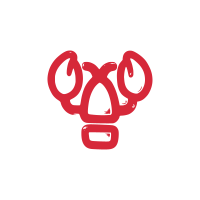
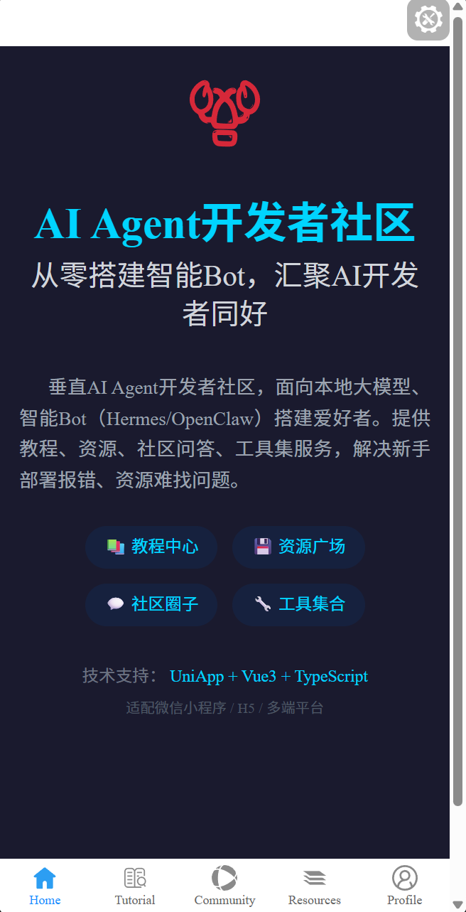

  

<h1 align="center">
  <a href="https://github.com/zachary-sandbox/clawparty-app" target="_blank">AI Agent开发者社区</a>
</h1>

  从零搭建智能Bot，汇聚AI开发者同好

`AI Agent开发者社区` —— 垂直AI Agent开发者社区小程序，面向本地大模型、智能Bot（Hermes/OpenClaw）搭建爱好者，提供教程、资源、社区问答、工具集服务。使用最新的前端技术栈 `uniapp` + `Vue3` + `Ts` + `Vite5` + `UnoCss` + `uni-ui` + `Pinia` 构建，实现一次开发，多端发布（微信小程序、抖音小程序、支付宝小程序、H5）.

内置了`首页`、`教程中心`、`资源广场`、`社区圈子`、`个人中心`等核心模块，解决新手部署报错、资源难找、无交流圈子等痛点，致力于打造国内轻量化私人Bot、本地AI Agent第一小众社区。

  <a href="https://clawparty-app.tech/" target="_blank">📖 文档地址</a>
  |
  <a href="https://clawparty-app.github.io/hello-clawparty-app" target="_blank">📱 DEMO 地址</a>
  |
  <a href="#商业需求">💰 商业模式</a>

---

## 产品特色

- ✨ **垂直领域专注**：只聚焦AI Agent、私人Bot、本地大模型，提供精准服务
- 🚀 **轻量化体验**：小程序无需下载，即用即走，随时随地学习交流
- 👥 **社区驱动**：提供问答、作品分享、资源互换生态
- 📚 **教程丰富**：从零基础入门到高阶定制，涵盖WSL环境、Docker部署、Ollama配置、Hermes教程、OpenClaw教程等
- 💾 **资源聚合**：开源源码、模型权重、配置模板、一键脚本统一下载渠道
- 🌙 **友好交互**：适配深色/浅色模式，卡片式布局，贴合小程序用户使用习惯

## 平台兼容性

| H5  | IOS | 安卓 | 微信小程序 | 字节小程序 | 快手小程序 | 支付宝小程序 | 钉钉小程序 | 百度小程序 |
| --- | --- | ---- | ---------- | ---------- | ---------- | ------------ | ---------- | ---------- |
| √   | √   | √    | √          | √          | √          | √            | √          | √          |

## ⚙️ 环境

- node>=18
- pnpm>=7.30
- Vue Official>=2.1.10
- TypeScript>=5.0

## &#x1F4C2; 快速开始

执行 `pnpm create clawparty-app` 创建项目
执行 `pnpm i` 安装依赖
执行 `pnpm dev` 运行 `H5`
执行 `pnpm dev:mp` 运行 `微信小程序`

## 📦 运行（支持热更新）

- web平台： `pnpm dev:h5`, 然后打开 [http://localhost:9000/](http://localhost:9000/)。
- weixin平台：`pnpm dev:mp` 然后打开微信开发者工具，导入本地文件夹，选择本项目的`dist/dev/mp-weixin` 文件。
- APP平台：`pnpm dev:app`, 然后打开 `HBuilderX`，导入刚刚生成的`dist/dev/app` 文件夹，选择运行到模拟器(开发时优先使用)，或者运行的安卓/ios基座。(如果是 `安卓` 和 `鸿蒙` 平台，则不用这个方式，可以把整个clawparty-app项目导入到hbx，通过hbx的菜单来运行到对应的平台。)

## 🔗 发布

- web平台： `pnpm build:h5`，打包后的文件在 `dist/build/h5`，可以放到web服务器，如nginx运行。如果最终不是放在根目录，可以在 `manifest.config.ts` 文件的 `h5.router.base` 属性进行修改。
- weixin平台：`pnpm build:mp`, 打包后的文件在 `dist/build/mp-weixin`，然后通过微信开发者工具导入，并点击右上角的"上传"按钮进行上传。
- APP平台：`pnpm build:app`, 然后打开 `HBuilderX`，导入刚刚生成的`dist/build/app` 文件夹，选择发行 - APP云打包。(如果是 `安卓` 和 `鸿蒙` 平台，则不用这个方式，可以把整个clawparty-app项目导入到hbx，通过hbx的菜单来发行到对应的平台。)

## 演示示例

## 商业需求

### 商业模式（前期免费，后期轻量化变现）

- **免费板块**：全部基础教程、公开源码、社区问答；
- **增值板块**：高阶定制教程、专属优质模型、一对一答疑、专属配置文件；
- **流量变现**：公众号+小程序流量主、无硬性广告，保证用户体验。

### 核心商业指标

- 用户指标：新增用户、留存率、日活访问次数；
- 内容指标：教程数量、资源上传量、社区发帖量；
- 转化指标：公众号关注转化率、付费资源下载率。

## 贡献

我们欢迎各种形式的贡献，包括但不限于：

- 🐛 提交Bug报告和修复
- 💡 提出功能建议
- 📝 完善文档
- 🌍 国际化翻译

如果您想贡献代码，请 Fork 本仓库，创建您的功能分支，提交您的更改并发送 Pull Request。

## 📄 许可证

[MIT](https://opensource.org/license/mit/)

Copyright (c) 2025 zacharylee

## 关注我们

扫码关注我们的公众号，获取最新AI Agent技术和社区动态：
<!-- 这里应该放置公众号二维码 -->

## 捐赠
<!-- 

-->
